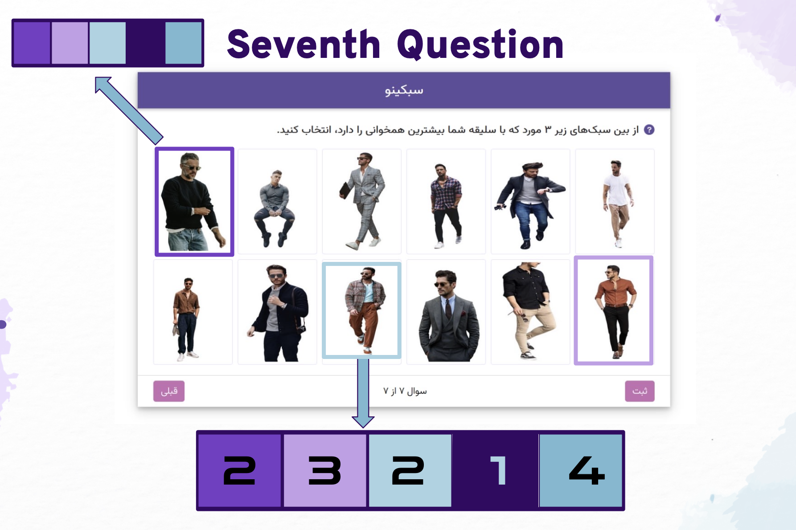

# Clothes Recommendation System

## Overview

This repository focuses on the implementation of a clothes recommendation system that tailors suggestions based on user preferences. We extract user's taste by asking some questions and then, represent it with a numeric vector. Finally, we utilize some similarity functions and clustering algorithms like Kmeans++ to recommend clothes. You can find out more details about this recommendation system on **[this google slide link](https://docs.google.com/presentation/d/1_Zp6elkHekhsne36Kl5X0O_5E8RYuCYJ-T1GjDTCuSw/edit?usp=sharing)** that is representation of the system.

## Features

- **User Engagement:** The system interacts with users by posing a series of questions to discern their clothing preferences.

- **Recommendation Algorithm:** Utilizes similarity functions to identify clothes styles akin to the user's preferences.

- **Clustering with Kmeans++:** Applies the Kmeans++ algorithm for effective clustering of clothes, enhancing the precision of recommendations.

## Questionnaire

The system employs a structured questionnaire to understand the user's clothing preferences:

1. **Age:** Inquire about the user's age(from one to four).
2. **Color:** Explore color preferences for clothing(from one to five).
3. **Design:** Assess preferences in terms of clothing design(from one to three).
4. **Size:** Gather information about preferred clothing sizes(from one to three).
5. **Formality:** Investigate the user's preference for formal or casual wear(from one to four).
6. **Prioritization:** Users rank the importance of the aforementioned features based on their taste.
7. **Visual Preferences:** Users select three photos from a curated collection representing different styles.

## User Representation

The gathered information is utilized to represent each user's taste as a numeric vector. Similarly, each clothing item is represented using the same method.

## Recommendation Process

1. **Similarity Calculation:** Apply similarity functions to identify clothes that align with the user's preferences.

2. **Kmeans Clustering:** Implement the Kmeans algorithm to cluster clothes based on style.

## Dataset

A comprehensive dataset is included, representing each photo with corresponding numeric vectors. This dataset facilitates the training and evaluation of the recommendation system. the photo of these tags are available on this [Kaggle dataset](https://www.kaggle.com/datasets/paramaggarwal/fashion-product-images-dataset).
